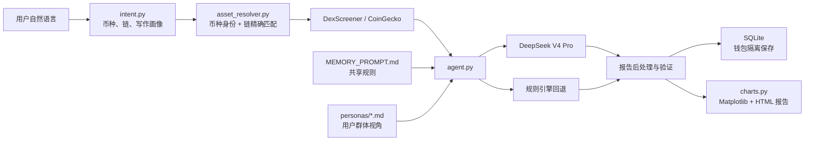
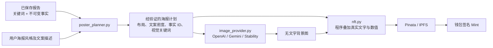

# meme_ops Agent 实际结构

## 分析主链路

`agent.py` 不是一个会自行操作钱包的自治 Agent，而是一个有明确输入输出边界的
分析编排器。钱包只负责登录签名和链上交易签名。

## 报告数据结构

每次新分析除评分和维度报告外，还保存：

- `request_intent`：币种、链和用户原始写作要求。
- `writing_profile`：解析后的语气、深度和篇幅。
- `report_keywords`：从数据和分析结论产生的关键词。
- `poster_facts`：由服务器计算的不可变事实及格式化值。
- `poster_narrative`：可供海报使用的标题与副标题。
- `generation_mode`：`deepseek` 或 `rules`。
- `generation_model`：实际使用的模型。

其中 `poster_facts` 不交给图片模型自由改写，避免流动性、成交量、交易对数量等
关键数值在生成过程中被篡改。

## NFT 生成链路

海报规划器只让模型选择 `poster_facts` 的 ID，最终数值由服务器填入。用户要求
“简洁、文字在两侧”时会减少事实数量并使用双栏；要求“学术报告”时会提高文案
密度、保留更多事实，并加入不含虚构数字的专业方法论描述。
