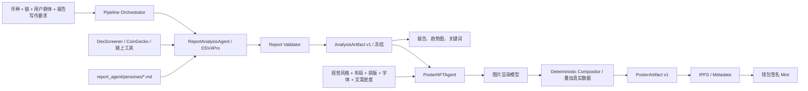

# Meme Ops 双 Agent 项目架构 V2

## 结论

该方案可行，并且比当前把分析、海报规划、图片生成混在同一条服务链里更清晰。

推荐使用“顺序编排的两个领域 Agent”，而不是让两个 Agent 自由对话：

1. `ReportAnalysisAgent` 先生成并冻结一份可追溯的分析产物。
2. `PosterNFTAgent` 只读取该产物和用户的视觉要求，生成海报及 NFT 元数据。

两个 Agent 通过带版本号的结构化 Artifact 交接。市场事实不能由海报 Agent 修改。

## 顺序工作流



## Agent 1：ReportAnalysisAgent

职责：

- 解析并精确锁定币种、链、合约地址。
- 调用市场与链上数据工具。
- 读取所选用户群体 Persona。
- 按独立的 `report_style` 生成有明显差异的报告。
- 生成趋势图数据、关键词、可验证事实、数据来源和模型信息。
- 输出结构化 `AnalysisArtifact`，通过验证后冻结。

输入：

```json
{
  "asset_query": "DOGE",
  "chain": "solana",
  "persona_id": "investor",
  "report_style": "Friendly, concise, beginner-oriented"
}
```

输出核心字段：

```json
{
  "schema_version": "analysis-artifact/v1",
  "analysis_id": 101,
  "asset_identity": {},
  "persona": {},
  "writing_profile": {},
  "dimensions": [],
  "trend_series": {},
  "report_keywords": [],
  "immutable_facts": [],
  "narrative": {},
  "provenance": [],
  "model": {},
  "artifact_hash": "sha256:..."
}
```

Persona 只属于分析 Agent。目标目录是：

```text
backend/agents/report_agent/personas/
  investor.md
  operator.md
  builder.md
  researcher.md
```

海报 Agent 不读取 Persona 文件，只读取已经冻结的分析结果。

## Agent 2：PosterNFTAgent

职责：

- 读取 `AnalysisArtifact`，不重新抓取或改写市场数据。
- 解析用户的视觉风格、场景、布局、排版、字体和文案密度。
- 从报告关键词与事实 ID 中选择需要展示的内容。
- 调用图片模型生成“无关键数字文字”的背景图。
- 使用确定性排版器叠加标题、摘要和不可修改的真实数据。
- 输出图片、元数据、模型/Prompt 哈希和分析产物哈希。

输入：

```json
{
  "analysis_id": 101,
  "art_style": "Futuristic Tokyo tower at night",
  "layout": "key copy on both sides",
  "typography": "condensed geometric sans serif",
  "copy_density": "concise",
  "aspect_ratio": "4:5"
}
```

输出核心字段：

```json
{
  "schema_version": "poster-artifact/v1",
  "poster_id": "MOP-...",
  "analysis_artifact_hash": "sha256:...",
  "image_uri": "ipfs://...",
  "metadata_uri": "ipfs://...",
  "selected_fact_ids": [],
  "provider": {},
  "prompt_hash": "sha256:...",
  "status": "mint_ready"
}
```

安全边界：

- 图片模型不负责生成关键数字，避免文字乱码和数据幻觉。
- 流动性、交易量、市值、持仓等数值由排版器从 `immutable_facts` 填入。
- 用户描述可以改变表达密度和视觉呈现，不能改变事实。
- 没有图片模型 API 时必须显示 `template_preview`，不能伪装为 AI 图片生成成功。

## 编排和任务状态

建议新增 `PipelineOrchestrator`，只负责顺序、状态、重试和幂等：

```text
analysis_requested
  -> resolving_asset
  -> collecting_data
  -> generating_report
  -> validating_report
  -> report_ready
  -> poster_requested
  -> planning_poster
  -> rendering_background
  -> composing_verified_copy
  -> poster_ready
  -> pinning_metadata
  -> mint_ready
  -> minted
```

同一个 `idempotency_key` 不得重复生成记录或重复发起 Mint。

## 目标文件结构

```text
backend/
  app/
    main.py
  api/
    routes/
      analysis.py
      watchlist.py
      poster.py
      nft.py
      social.py
      users.py
  agents/
    report_agent/
      agent.py
      schemas.py
      validators.py
      prompts/
        system.md
      personas/
        investor.md
        operator.md
        builder.md
        researcher.md
      tools/
        asset_resolver.py
        dexscreener.py
        coingecko.py
        chain_data.py
    poster_agent/
      agent.py
      planner.py
      schemas.py
      validators.py
      prompts/
        background.md
        copy_planner.md
      providers/
        base.py
        openai_image.py
        gemini_image.py
        stability.py
        flux.py
      compositor.py
      storage/
        ipfs.py
  orchestration/
    pipeline.py
    states.py
    idempotency.py
  domain/
    analysis_artifact.py
    poster_artifact.py
  repositories/
    analyses.py
    watchlist.py
    posters.py
    users.py
  infrastructure/
    database.py
    settings.py

frontend/
  pages/
    analysis.js
    watchlist.js
    community.js
    profile.js
    poster.js
  components/
    analysis_input.js
    watchlist_sidebar.js
    report_viewer.js
    poster_editor.js
  services/
    api.js
    wallet.js

tests/
  unit/
    report_agent/
    poster_agent/
  integration/
    analysis_pipeline/
    poster_pipeline/
    watchlist/
  e2e/
    analysis_to_mint/
```

## 数据表建议

- `analysis_requests`：保存原始资产输入、Persona、报告风格和状态。
- `analysis_artifacts`：保存不可变报告 JSON、版本和哈希。
- `poster_requests`：保存用户视觉描述与状态。
- `poster_artifacts`：保存海报、模型、Prompt 哈希与分析哈希。
- `pipeline_events`：记录每个阶段、失败原因和耗时。
- `watchlist`：继续按钱包地址隔离。

## 迁移顺序

1. 先保留现有 API，在内部加入 Artifact schema、模型状态和日志。
2. 将当前 `agent.py` 拆入 `agents/report_agent/`，迁移 `personas/`。
3. 将海报规划、图片 provider、排版器拆入 `agents/poster_agent/`。
4. 加入 Pipeline 状态、幂等键和显式错误，去除静默回退造成的误判。
5. 选定图片模型后实现一个 Provider；其他 Provider 保持统一接口。
6. 最后接 IPFS 和钱包 Mint，并把分析哈希写入 NFT metadata。

README 暂不修改。当前代码可以渐进迁移，不需要一次性重写。
