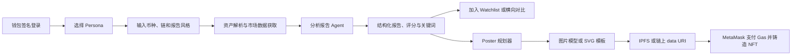

# meme_ops

## Live deployment

- Current release: `v0.3.0`
- Application: https://memeops-production.up.railway.app/
- API health: https://memeops-production.up.railway.app/api/health
- API documentation: https://memeops-production.up.railway.app/docs

The production service runs on Railway with a persistent Volume mounted at
`/app/data`; SQLite is stored at `/app/data/meme_ops.db`.

`meme_ops` 是一个面向 Meme 资产的 Web3 分析与社区应用。项目可以根据币种名称、链名称或合约地址获取市场数据，调用分析报告 Agent 生成不同用户视角的报告，并将报告进一步制作成可铸造的 Poster NFT。

项目当前包含：

- Meme 资产识别与多链精确匹配
- DeepSeek/DSV4PRO 分析报告 Agent
- Investor、Community Operator、Project Builder、Researcher 四种 Persona
- 可自定义详细、简洁、学术、新手友好等报告表达方式
- 钱包隔离的分析历史和 Watchlist
- 2–5 个 Watchlist 资产横向对比
- 类 Twitter 的社区、帖子、回复、点赞、转发、引用和收藏
- 个人主页、资料编辑和 Poster NFT 展示
- AI 图片背景或确定性 SVG 模板海报
- MetaMask 签名登录和 ERC-721 Poster NFT 铸造
- Pinata/IPFS 或受大小限制的链上 `data:` URI 元数据

> 本项目提供研究和数据整理工具，不构成投资建议。Meme 资产价格波动和流动性风险很高，请自行核验数据并控制风险。

## 目录

- [工作流程](#工作流程)
- [技术栈](#技术栈)
- [快速开始](#快速开始)
- [Railway 部署](#railway-部署)
- [环境变量配置](#环境变量配置)
- [功能操作](#功能操作)
- [部署 Poster NFT 合约](#部署-poster-nft-合约)
- [Poster NFT 图片与存储](#poster-nft-图片与存储)
- [测试](#测试)
- [API 概览](#api-概览)
- [项目结构](#项目结构)
- [常见问题](#常见问题)
- [安全与生产部署注意事项](#安全与生产部署注意事项)

## 工作流程



分析报告和 NFT 图片是两个独立阶段：

1. 分析报告 Agent 根据资产、链、Persona 和报告写作方向生成报告。
2. 报告中的评分、风险、市场数据和关键词会保留下来。
3. Poster NFT 阶段根据用户输入的视觉风格、布局和文案方向生成图片。
4. Poster 风格只改变视觉和表达，不应修改报告中的关键市场数据。

## 技术栈

| 层级 | 技术 |
|---|---|
| 前端 | 原生 HTML、CSS、JavaScript |
| 后端 | Python、FastAPI、Uvicorn |
| 数据库 | SQLite |
| 分析模型 | DeepSeek OpenAI-compatible API |
| 市场数据 | DexScreener、CoinGecko |
| 图片生成 | OpenAI、Gemini 或 Stability |
| NFT 存储 | Pinata/IPFS 或链上 Base64 Data URI |
| 钱包 | MetaMask / EIP-1193 Provider |
| 合约 | Solidity 0.8.20、OpenZeppelin ERC-721 |
| 默认测试链 | Monad Testnet，Chain ID `10143` |

## 快速开始

### 1. 环境要求

- Python 3.11 或更高版本
- Git
- 支持 MetaMask 的浏览器
- 可选：DeepSeek API Key
- 可选：OpenAI、Gemini 或 Stability 图片 API Key
- 可选：Pinata JWT
- 可选：已部署的 `PosterNFT.sol` 合约

前端没有 Node.js 构建步骤，可以直接通过静态 HTTP 服务运行。

### 2. 克隆仓库

```bash
git clone https://github.com/zz-0816/meme_ops.git
cd meme_ops
```

### 3. 创建 Python 虚拟环境

Windows PowerShell：

```powershell
python -m venv .venv
.\.venv\Scripts\Activate.ps1
python -m pip install --upgrade pip
pip install -r backend\requirements.txt
```

macOS / Linux：

```bash
python3 -m venv .venv
source .venv/bin/activate
python -m pip install --upgrade pip
pip install -r backend/requirements.txt
```

### 4. 创建 `.env`

Windows PowerShell：

```powershell
Copy-Item .env.example .env
```

macOS / Linux：

```bash
cp .env.example .env
```

然后编辑项目根目录下的 `.env`。真实 `.env` 已被 `.gitignore` 排除，不要将 API Key、JWT、私钥或助记词提交到 Git。

最小 AI 报告配置：

```env
DEEPSEEK_API_KEY=your_deepseek_api_key
DEEPSEEK_BASE_URL=https://api.deepseek.com/v1
DEEPSEEK_MODEL=deepseek-v4-pro
```

如果不填写 `DEEPSEEK_API_KEY`，系统仍可运行，但分析报告会显示为 Rules-engine fallback。

### 5. 启动后端

在项目根目录运行：

```bash
python backend/main.py
```

默认地址：

- API：`http://localhost:8788`
- Swagger 文档：`http://localhost:8788/docs`
- 健康检查：`http://localhost:8788/api/health`

后端第一次启动时会自动创建：

```text
data/meme_ops.db
```

数据库属于本地运行数据，默认不会提交到 Git。

### 6. 启动前端

打开第二个终端，在项目根目录运行：

```bash
python -m http.server 3000 --directory frontend
```

浏览器打开：

```text
http://localhost:3000
```

不要直接双击 `frontend/index.html` 以 `file://` 方式运行，否则浏览器的跨域、钱包和模块行为可能不一致。

## Railway 部署

仓库根目录已经提供：

```text
Dockerfile
railway.json
.dockerignore
```

生产容器由 FastAPI 同时提供前端静态页面和 `/api` 接口，因此公网环境只需要一个 Railway Service 和一个域名。

### 1. 从 GitHub 创建 Service

1. 登录 Railway。
2. 创建 New Project。
3. 选择 `Deploy from GitHub repo`。
4. 选择 `zz-0816/meme_ops`。
5. Railway 会自动识别根目录的 `Dockerfile`。

### 2. 配置生产变量

必须至少配置：

```env
APP_ENV=production
JWT_SECRET=<strong-random-secret>
DATABASE_PATH=/app/data/meme_ops.db

DEEPSEEK_API_KEY=
DEEPSEEK_BASE_URL=https://api.deepseek.com/v1
DEEPSEEK_MODEL=deepseek-v4-pro

NFT_CONTRACT_ADDRESS=
NFT_CHAIN=monad-testnet
NFT_CHAIN_ID=10143
NFT_EXPLORER_URL=https://testnet.monadexplorer.com
```

根据需要继续配置图片 Provider 和 `PINATA_JWT`。不要把生产值写回 `.env.example` 或提交到 GitHub。

### 3. 添加持久 Volume

为 Web Service 添加 Volume，并设置：

```text
Mount Path: /app/data
```

当前 SQLite 文件会保存在：

```text
/app/data/meme_ops.db
```

如果没有挂载 Volume，Railway 重新部署或重启容器后，用户、帖子、Watchlist、报告和 NFT 展示记录可能丢失。

SQLite + Volume 只适合单实例运行。不要为当前版本开启多个 Replica；正式扩容前应迁移到 PostgreSQL。

### 4. 生成公网域名

进入 Service 的 Networking，点击 `Generate Domain`。Railway 会提供 HTTPS 域名。

验证：

```text
https://<your-domain>/api/health
https://<your-domain>/
https://<your-domain>/docs
```

前端在 `localhost:3000` 时会连接本地 `localhost:8788`；部署后会自动使用当前网页域名作为 API 地址，不需要手动修改 `frontend/app.js`。

## 环境变量配置

完整示例位于 [.env.example](./.env.example)。

### 运行环境

| 变量 | 本地默认值 | Railway 建议值 | 说明 |
|---|---|---|---|
| `APP_ENV` | `development` | `production` | 控制开发热重载 |
| `JWT_SECRET` | 空 | 强随机字符串 | 保持钱包登录会话在重启后仍可验证 |
| `DATABASE_PATH` | `data/meme_ops.db` | `/app/data/meme_ops.db` | SQLite 文件位置 |
| `CORS_ORIGINS` | 本地 3000 端口 | 可留默认或填写正式域名 | 逗号分隔的跨域来源 |
| `PORT` | `8788` | Railway 自动注入 | Web Service 监听端口 |

### 分析报告模型

| 变量 | 是否必需 | 默认/示例 | 说明 |
|---|---:|---|---|
| `DEEPSEEK_API_KEY` | AI 报告必需 | 空 | DeepSeek 或兼容服务的 API Key |
| `DEEPSEEK_BASE_URL` | 否 | `https://api.deepseek.com/v1` | OpenAI-compatible API 地址 |
| `DEEPSEEK_MODEL` | 否 | `deepseek-v4-pro` | 服务端支持的模型名称 |

修改模型相关环境变量后必须重启 FastAPI。配置在后端模块加载时读取，刷新浏览器不会重新加载 `.env`。

系统会先生成不可由写作风格修改的分析核心，包括评分、风险和维度数据，再让模型生成不同表达方式。模型请求失败、返回无效 JSON 或未配置 Key 时，系统会使用规则报告并在界面标明 fallback。

### 图片模型

| 变量 | 说明 |
|---|---|
| `IMAGE_PROVIDER` | `auto`、`openai`、`gemini` 或 `stability` |
| `OPENAI_API_KEY` | OpenAI 图片 API Key |
| `OPENAI_IMAGE_MODEL` | OpenAI 图片模型名称 |
| `GEMINI_API_KEY` | Gemini API Key |
| `GEMINI_IMAGE_MODEL` | Gemini 图片模型名称 |
| `STABILITY_API_KEY` | Stability API Key |
| `STABILITY_IMAGE_MODEL` | Stability 图片模型或接口变体 |

`IMAGE_PROVIDER=auto` 时，后端按 OpenAI、Gemini、Stability 的顺序选择首个已配置的 Provider。

如果没有配置任何图片 Key：

- 分析报告仍然可以使用 DeepSeek。
- Poster NFT 会使用确定性 SVG 模板。
- 用户输入的 Cyberpunk、Japanese、Football、Technology City 等关键词会影响模板场景，但不会得到真正的 AI 栅格图。

### IPFS 与链上元数据限制

| 变量 | 默认值 | 说明 |
|---|---:|---|
| `PINATA_JWT` | 空 | 配置后将 Poster 图片和元数据上传到 IPFS |
| `ONCHAIN_METADATA_WARNING_BYTES` | `12000` | 链上 Data URI 达到该大小时提示高 Gas |
| `ONCHAIN_METADATA_MAX_BYTES` | `24000` | 超过该大小时阻止直接链上铸造 |

当 `PINATA_JWT` 为空时，后端会生成标准：

```text
data:application/json;base64,...
```

限制针对 Base64 编码后的实际 `tokenURI` 字节数。达到警告值后，前端会先调用 `eth_estimateGas` 并要求用户再次确认；超过硬限制会返回 HTTP 413。

AI 栅格图片通常远大于默认 24 KB，因此正式使用 AI 图片时建议配置 Pinata。提高硬限制虽然可以允许更大的链上数据，但 Gas 可能非常昂贵。

### NFT 合约

| 变量 | 示例 | 说明 |
|---|---|---|
| `NFT_CONTRACT_ADDRESS` | `0x...` | 已部署的 `PosterNFT` 合约地址 |
| `NFT_CHAIN` | `monad-testnet` | 前端展示的网络名称 |
| `NFT_CHAIN_ID` | `10143` | 十进制 Chain ID |
| `NFT_EXPLORER_URL` | `https://testnet.monadexplorer.com` | 交易和合约浏览器基础地址 |

变量名必须是 `NFT_CONTRACT_ADDRESS`，不要写成 `NFT_CONTRAT_ADDRESS`。

`NFT_CONTRACT_ADDRESS` 必须是部署后的合约地址，不能填写：

- 用户钱包地址
- 部署者地址
- RPC 地址
- 交易哈希
- Solidity 文件中的占位字符串

用户钱包地址不需要写入 `.env`。连接 MetaMask 后，前端会自动读取当前钱包地址，并用该地址签名登录和发送交易。

## 功能操作

### 钱包登录

1. 点击右上角 `Connect Wallet`。
2. MetaMask 请求连接当前账户。
3. 后端生成一次性 nonce。
4. MetaMask 请求 `personal_sign` 消息签名。
5. 后端验证签名并签发会话 Token。

登录签名不消耗 Gas。只有 NFT 铸造等链上交易需要 Gas。

系统不会请求或保存钱包私钥、助记词。不同钱包的 Watchlist、历史报告、比较报告、收藏和个人资料相互隔离。

未配置 `JWT_SECRET` 时，开发版会在后端启动时随机生成 Secret，因此重启后旧会话会失效。Railway 部署必须配置持久的强随机 `JWT_SECRET`。

### 生成分析报告

1. 打开 `Analyze`。
2. 选择 Persona：
   - `Investor`
   - `Community Operator`
   - `Project Builder`
   - `Researcher`
3. 输入资产信息。
4. 可选填写 `Report writing direction`。
5. 点击 `Analyze`。

支持的输入示例：

```text
pepe
pepe sol
Dogecoin solana
0x1234...abcd
Analyze DOGE on Solana in a concise and beginner-friendly tone
```

资产名称和链会独立解析：

- `pepe sol` 表示 Solana 上的 Pepe。
- 同名但不同链的资产会保存为不同历史分组。
- 如果名称存在歧义，优先使用合约地址。

报告风格示例：

```text
具体完整，包含证据、解释、方法限制和投资含义
简洁简单，只保留关键数据和直接结论
Academic market-microstructure memo with methodology and limitations
Friendly beginner explanation using short sentences
```

写作方向只改变解释深度、语气和篇幅，不应改变评分、风险等级和原始市场数据。

### Watchlist

分析完成后点击资产旁的星标加入 Watchlist。

Watchlist 支持：

- 拖拽调整顺序
- 添加币种备注
- 点击币种查看该币种与链的全部历史报告
- Edit 模式多选删除
- 独立 Watchlist 市场页面
- 钱包级数据隔离

Watchlist 不提供独立手动添加输入框，资产必须先经过搜索/分析后再加入。

### 横向对比

1. 在左侧 Watchlist 点击 `Compare`。
2. 勾选 2–5 个资产。
3. 点击 `Create comparison`。
4. 选择统一 Persona。
5. 可选填写比较报告写作方向。
6. 点击 `Generate comparison`。

系统会依次为每个资产重新运行分析 Agent，随后生成：

- 同维度横向评分矩阵
- 每个资产的 Strengths 和 Weaknesses
- 风险等级
- 排名
- 最高分资产及原因
- 综合比较总结

比较报告会保存到左侧 `COMPARISON REPORTS`，包含名称、Persona 和日期，并且仅当前钱包可访问。

命名规则：

- 两个资产：`Pepe vs Doge`
- 三个资产：完整显示三个名称
- 超过三个：`Pepe vs Doge vs … (4 assets)`

当前比较流程为了保证同一 Persona 和完整报告一致性，采用顺序分析，并在所有单币报告完成后额外调用一次模型生成横向总结。选择资产较多或模型发生 JSON 重试时，可能需要数分钟。

### 社区

Community 页面支持：

- Recommended 和 Following 信息流
- 发布最多 500 字的帖子
- 上传、粘贴或拖拽 PNG 图片
- `@用户名` 提及
- 回复
- 点赞/取消点赞
- 转发/取消转发
- 引用帖子
- 收藏
- 浏览量展示
- 帖子详情独立 URL
- 删除自己的帖子

纯转发采用用户与原帖唯一约束，同一用户不能对同一帖子无限重复转发。

### Home 与个人资料

Home 页面支持：

- 帖子
- Poster NFTs
- 私有书签
- 编辑头像、名称和个人简介
- PNG 文件头像
- 默认 Emoji 头像
- 删除自己发布的帖子
- 重命名、分类或隐藏本地 NFT 展示记录

钱包地址是账户身份，不能通过资料编辑修改。关注和粉丝列表只有账户本人可以打开；其他用户只能看到公开计数。

### 生成和铸造 Poster NFT

1. 先完成一份分析报告。
2. 在报告下方填写 Poster style。
3. 如果留空，默认使用 `Cyberpunk`。
4. 预览海报并删除不需要展示的可选内容块。
5. 点击 Mint。
6. 后端生成图片和 NFT 元数据。
7. 配置 Pinata 时先上传 IPFS；未配置时检查链上 Data URI 大小。
8. 前端确认钱包网络和合约字节码。
9. MetaMask 显示 Gas。
10. 用户确认后发送交易。
11. 交易确认后写入本地 NFT 展示记录。

Poster NFT 包含唯一 Poster ID、币种、链、Persona、评分、风险、分析时间、图片 Provider 和报告关联 ID。

隐藏 NFT 只会从当前应用的个人主页隐藏记录，不会销毁或修改已经存在于链上的 ERC-721。

## 部署 Poster NFT 合约

合约文件：

```text
contracts/PosterNFT.sol
```

当前仓库没有自动部署脚本，最直接的测试方式是使用 Remix。

### Remix 部署步骤

1. 打开 Remix。
2. 导入 `contracts/PosterNFT.sol`。
3. 安装或允许 Remix 解析 OpenZeppelin imports。
4. 使用 Solidity `0.8.20` 或兼容版本编译。
5. 在 Advanced Configuration 中将 EVM Version 设置为 `paris`。
6. MetaMask 切换到目标测试网。
7. Remix Environment 选择 `Injected Provider - MetaMask`。
8. 部署构造参数，例如：

```text
name_: Meme Ops Poster
symbol_: MOP
```

9. 等待部署交易确认。
10. 复制 Remix `Deployed Contracts` 中显示的合约地址。
11. 写入 `.env`：

```env
NFT_CONTRACT_ADDRESS=0xYourDeployedContractAddress
NFT_CHAIN=monad-testnet
NFT_CHAIN_ID=10143
NFT_EXPLORER_URL=https://testnet.monadexplorer.com
```

12. 重启后端。

铸造前必须确认：

- MetaMask 当前 Chain ID 与 `NFT_CHAIN_ID` 一致。
- 合约地址在当前网络上执行 `eth_getCode` 返回非空字节码。
- 钱包拥有足够的测试币支付 Gas。
- `.env` 修改后已经重启后端。

## Poster NFT 图片与存储

### 有图片模型 Key

用户的视觉描述会转换为场景、建筑、灯光、材质、元素和布局提示，再与报告关键词一起发送给已配置的图片 Provider。模型只生成背景，关键评分和市场数据由应用后续叠加，减少图片模型篡改数字的风险。

### 没有图片模型 Key

系统使用确定性 SVG 模板。不同关键词会影响模板配色和预设场景，但不会达到真正多模态图片模型的变化幅度。

### 使用 Pinata

填写：

```env
PINATA_JWT=your_pinata_jwt
```

AI 图片和元数据会先上传到 IPFS，合约只保存较短的 IPFS URI，Gas 通常明显低于直接保存完整图片。

### 不使用 Pinata

保持：

```env
PINATA_JWT=
ONCHAIN_METADATA_WARNING_BYTES=12000
ONCHAIN_METADATA_MAX_BYTES=24000
```

系统会直接使用链上 JSON Data URI。适合体积较小的 SVG 模板，不适合大型 AI 栅格图片。

## 测试

确保虚拟环境已经激活并安装依赖。

运行全部自动化测试：

```bash
python -m unittest discover -s tests -v
```

测试范围包括：

- 资产名称与链解析
- 不同报告风格
- 分析核心评分锁定
- Watchlist 与历史记录钱包隔离
- 社区点赞、转发和收藏行为
- 比较报告命名、排名和顺序分析
- NFT 元数据警告与硬限制
- 静态 UI 必要功能

可选的真实模型风格测试：

```bash
python scripts/report_style_check.py
```

该脚本会请求实时市场数据并实际调用已配置的 DeepSeek 模型，可能产生 API 用量。

## API 概览

启动后可以通过 `http://localhost:8788/docs` 查看完整交互文档。

| 分类 | 主要接口 |
|---|---|
| 市场 | `GET /api/market/top-memes` |
| 登录 | `POST /api/auth/nonce`、`POST /api/auth/login`、`GET /api/auth/me` |
| 分析 | `POST /api/analyze`、`GET /api/history`、`GET /api/analysis/{id}` |
| 图表 | `GET /api/charts/{analysis_id}` |
| 对比 | `POST /api/comparisons`、`GET /api/comparisons` |
| Watchlist | `GET/POST /api/watchlist`、`GET /api/watchlist/market` |
| 社区 | `GET/POST /api/posts`、like、repost、bookmark、replies |
| 用户 | `GET /api/users/{address}`、`PATCH /api/users/profile` |
| NFT | `GET /api/nft/contract`、`POST /api/nft/metadata/{analysis_id}`、`POST /api/nft/mint` |

除公开市场数据和部分 NFT 展示接口外，大多数用户数据接口需要：

```http
Authorization: Bearer <wallet-session-token>
```

## 项目结构

```text
meme_ops/
├─ .env.example                 # 环境变量模板
├─ MEMORY_PROMPT.md             # 分析 Agent 共享提示词
├─ AGENT_ARCHITECTURE.md        # Agent 架构说明
├─ PROJECT_ARCHITECTURE_V2.md   # 项目架构规划
├─ backend/
│  ├─ main.py                   # FastAPI 路由和启动入口
│  ├─ agent.py                  # 分析报告 Agent
│  ├─ asset_resolver.py         # 币种名称、链和合约解析
│  ├─ comparison.py             # 2–5 资产横向比较
│  ├─ poster_planner.py         # Poster 内容和布局规划
│  ├─ image_provider.py         # 图片模型、Pinata 和链上限制
│  ├─ nft.py                    # Poster 图片与 NFT 元数据
│  ├─ auth.py                   # 钱包签名登录
│  ├─ database.py               # SQLite 数据访问和钱包隔离
│  ├─ charts.py                 # 报告图表生成
│  └─ requirements.txt
├─ contracts/
│  └─ PosterNFT.sol             # ERC-721 合约
├─ frontend/
│  ├─ index.html
│  ├─ app.js
│  └─ style.css
├─ personas/
│  ├─ investor.md
│  ├─ operator.md
│  ├─ builder.md
│  └─ researcher.md
├─ sql/
│  └─ schema.sql
├─ scripts/
│  └─ report_style_check.py
├─ tests/
└─ data/                         # 本地运行数据库，不提交 Git
```

## 常见问题

### 修改 `.env` 后为什么没有生效？

模型、图片 Provider 和 NFT 合约配置在后端模块加载时读取。修改 `.env` 后必须停止并重新启动 FastAPI。

### 报告显示 Rules-engine fallback

检查：

- `DEEPSEEK_API_KEY` 是否填写
- `DEEPSEEK_BASE_URL` 是否与 Key 对应
- `DEEPSEEK_MODEL` 是否被该服务支持
- 后端终端是否显示 HTTP、限流或 JSON 错误

### 为什么 Compare 加载很久？

Compare 会对 2–5 个资产依次执行数据获取和完整报告生成，全部完成后再调用一次模型生成横向总结。资产越多、报告越详细、模型响应越慢，等待时间越长。

### Poster 风格为什么只有颜色变化？

如果 `/api/nft/image-provider` 显示 `configured: false`，当前使用的是 SVG 模板而不是 AI 图片模型。至少配置一个图片 Provider Key 并重启后端。

### Mint failed: The NFT contract is not deployed

`NFT_CONTRACT_ADDRESS` 为空、是零地址，或者修改 `.env` 后没有重启后端。

### External transactions to internal accounts cannot include data

通常说明 `NFT_CONTRACT_ADDRESS` 填成了普通钱包地址，而不是部署后的合约地址。

### No NFT contract was found

钱包网络与配置网络不一致，或者合约地址在当前链上没有字节码。

### insufficient funds for transfer

当前钱包没有足够的目标网络原生币支付 Gas。测试网需要先从对应 Faucet 获取测试币。

### HTTP 413 Poster metadata too large

未配置 Pinata，并且 Base64 后的链上元数据超过 `ONCHAIN_METADATA_MAX_BYTES`。缩小内容、配置 Pinata，或在充分理解 Gas 风险后提高限制。

### 后端重启后需要重新连接钱包

如果没有配置 `JWT_SECRET`，后端每次启动都会随机生成 Secret，因此旧 Token 会失效。生产环境配置持久的 `JWT_SECRET` 后不会因普通重启而失效。

### 前端无法连接后端

确认：

- 后端运行在 `http://localhost:8788`
- 前端运行在 `http://localhost:3000`
- 没有直接用 `file://` 打开 HTML
- 生产环境使用同一 FastAPI 域名提供前端和 API；如果拆分前后端域名，需要设置 `CORS_ORIGINS`

## 安全与生产部署注意事项

- 永远不要把 `.env`、私钥、助记词或生产数据库提交到 Git。
- 本项目不需要服务器钱包私钥，链上交易必须由用户钱包确认。
- 当前 SQLite 适合本地开发和单实例演示，不适合多实例生产部署。
- 生产环境必须通过平台 Secret 配置持久的高强度 `JWT_SECRET`。
- 生产环境应增加速率限制、验证码、输入文件病毒检测和严格 CSP。
- PNG 图片以数据形式保存时会增加数据库体积，生产环境建议使用对象存储。
- 单服务生产部署默认使用同源 API；拆分域名时必须收紧 `CORS_ORIGINS`。
- 市场 API 可能限流或返回缺失字段，报告中的数据源和限制说明必须保留。
- 智能合约一旦部署不可像普通后端代码一样直接修改，主网部署前需要审计和完整测试。

## 贡献

欢迎提交 Issue 和 Pull Request。提交前请运行：

```bash
python -m unittest discover -s tests -v
```

并确认没有提交 `.env`、数据库、缓存、私钥或第三方 API 凭据。
